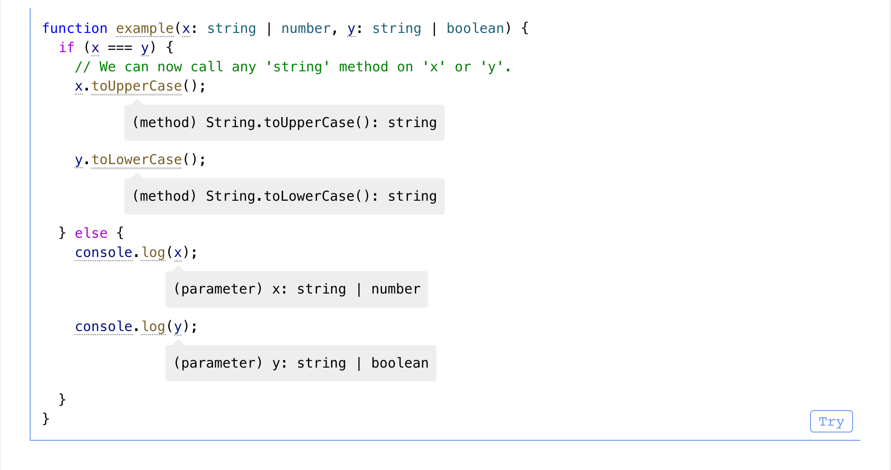
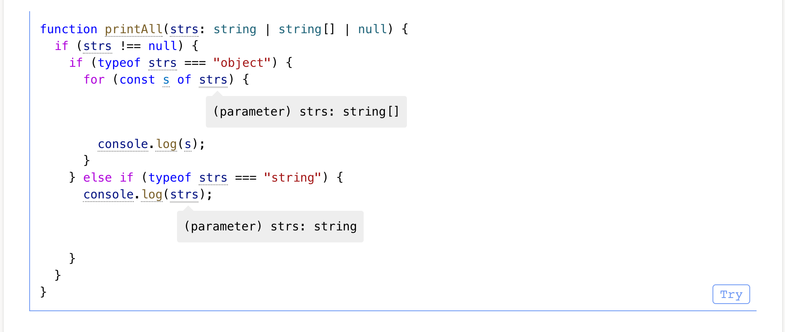
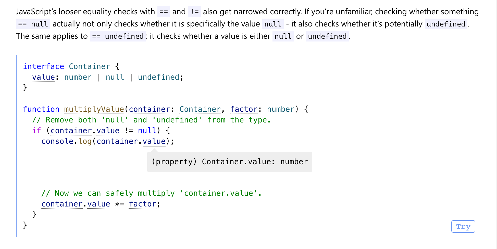
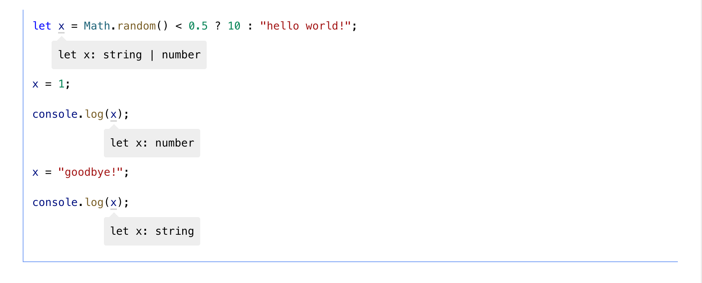
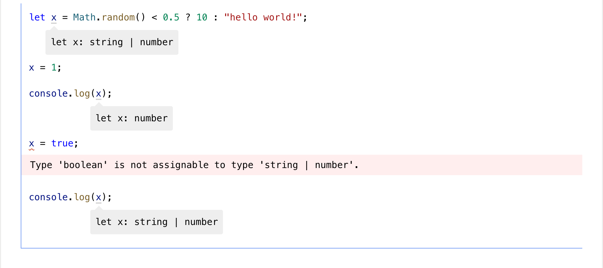

# Narrowing

Imagine we have a function called `padLeft`.

```ts
function padLeft(padding: number | string, input: string): string {
  throw new Error("Not implemented yet!");
}
```

If `padding` is a `number`, it will treat that as the number of spaces we want to prepend to `input`. If `padding` is a string, it should just prepend padding to input. Let’s try to implement the logic for when padLeft is passed a number for padding.


Uh-oh, we’re getting an error on `padding`. TypeScript is warning us that adding a `number | string` to a `number` might not give us what we want, and it’s right. In other words, we haven’t explicitly checked if padding is a `number` first, nor are we handling the case where it’s a `string`, so let’s do exactly that.

```ts
function padLeft(padding: number | string, input: string) {
  if (typeof padding === "number") {
    return " ".repeat(padding) + input;
  }
  return padding + input;
}
```

If this mostly looks like uninteresting JavaScript code, that’s sort of the point. Apart from the annotations we put in place, this TypeScript code looks like JavaScript. The idea is that TypeScript’s type system aims to make it as easy as possible to write typical JavaScript code without bending over backwards to get type safety.

While it might not look like much, there’s actually a lot going under the covers here. Much like how TypeScript analyzes runtime values using static types, it overlays type analysis on JavaScript’s runtime control flow constructs like `if/else`, conditional ternaries, loops, truthiness checks, etc., which can all affect those types.

Within our `if` check, TypeScript sees typeof `padding === "number"` and understands that as a special form of code called a _type guard_. TypeScript follows possible paths of execution that our programs can take to analyze the most specific possible type of a value at a given position. It looks at these special checks (called _type guards_) and assignments, and the process of refining types to more specific types than declared is called _narrowing_. In many editors we can observe these types as they change, and we’ll even do so in our examples.


## `typeof` type guards

As we’ve seen, JavaScript supports a `typeof` operator which can give very basic information about the type of values we have at runtime. TypeScript expects this to return a certain set of strings:

- `"string"`
- `"number"`
- `"bigint"`
- `"boolean"`
- `"symbol"`
- `"undefined"`
- `"object"`
- `"function"`

Like we saw with `padLeft`, this operator comes up pretty often in a number of JavaScript libraries, and TypeScript can understand it to narrow types in different branches.

In TypeScript, checking against the value returned by `typeof` is a type guard. Because TypeScript encodes how typeof operates on different values, it knows about some of its quirks in JavaScript. For example, notice that in the list above, `typeof` doesn’t return the string `null`. Check out the following example:


In the `printAll` function, we try to check if `strs` is an object to see if it’s an array type (now might be a good time to reinforce that arrays are object types in JavaScript). But it turns out that in JavaScript, `typeof null` is actually `"object"`! This is one of those unfortunate accidents of history.

Users with enough experience might not be surprised, but not everyone has run into this in JavaScript; luckily, TypeScript lets us know that `strs` was only narrowed down to `string[] | null` instead of just `string[]`.

This might be a good segue into what we’ll call “truthiness” checking.

## Truthiness narrowing

Truthiness might not be a word you’ll find in the dictionary, but it’s very much something you’ll hear about in JavaScript.

In JavaScript, we can use any expression in conditionals, `&&`s, `||`s, `if` statements, Boolean negations (`!`), and more. As an example, if statements don’t expect their condition to always have the type boolean.

```ts
function getUsersOnlineMessage(numUsersOnline: number) {
  if (numUsersOnline) {
    return `There are ${numUsersOnline} online now!`;
  }
  return "Nobody's here. :(";
}
```

In JavaScript, constructs like if first “coerce” their conditions to booleans to make sense of them, and then choose their branches depending on whether the result is true or false. Values like

- `0`
- `NaN`
- `""` (the empty string)
- `0n` (the `bigint` version of zero)
- `null`
- `undefined`

all coerce to `false`, and other values get coerced `true`. You can always coerce values to `booleans` by running them through the `Boolean` function, or by using the shorter double-Boolean negation. (The latter has the advantage that TypeScript infers a narrow literal boolean type `true`, while inferring the first as type `boolean`.)

```ts
// both of these result in 'true'
Boolean("hello"); // type: boolean, value: true
!!"world"; // type: true,    value: true
```

It’s fairly popular to leverage this behavior, especially for guarding against values like `null` or `undefined`. As an example, let’s try using it for our `printAll` function.

```ts
function printAll(strs: string | string[] | null) {
  if (strs && typeof strs === "object") {
    for (const s of strs) {
      console.log(s);
    }
  } else if (typeof strs === "string") {
    console.log(strs);
  }
}
```

You’ll notice that we’ve gotten rid of the error above by checking if `strs` is truthy. This at least prevents us from dreaded errors when we run our code like:

```
TypeError: null is not iterable
```

Keep in mind though that truthiness checking on primitives can often be error prone. As an example, consider a different attempt at writing `printAll`

```ts
function printAll(strs: string | string[] | null) {
  // !!!!!!!!!!!!!!!!
  //  DON'T DO THIS!
  //   KEEP READING
  // !!!!!!!!!!!!!!!!
  if (strs) {
    if (typeof strs === "object") {
      for (const s of strs) {
        console.log(s);
      }
    } else if (typeof strs === "string") {
      console.log(strs);
    }
  }
}
```

We wrapped the entire body of the function in a truthy check, but this has a subtle downside: we may no longer be handling the empty string case correctly.

TypeScript doesn’t hurt us here at all, but this is behavior worth noting if you’re less familiar with JavaScript. TypeScript can often help you catch bugs early on, but if you choose to do _nothing_ with a value, there’s only so much that it can do without being overly prescriptive. If you want, you can make sure you handle situations like these with a linter.

One last word on narrowing by truthiness is that Boolean negations with `!` filter out from negated branches.

```ts
function multiplyAll(
  values: number[] | undefined,
  factor: number
): number[] | undefined {
  if (!values) {
    return values;
  } else {
    return values.map((x) => x * factor);
  }
}
```

## Equality narrowing

TypeScript also uses `switch` statements and equality checks like `===`, `!==`, `==`, and `!=` to narrow types. For example:



When we checked that `x` and `y` are both equal in the above example, TypeScript knew their types also had to be equal. Since `string` is the only common type that both `x` and `y` could take on, TypeScript knows that `x` and `y` must be a string in the first branch.

Checking against specific literal values (as opposed to variables) works also. In our section about truthiness narrowing, we wrote a `printAll` function which was error-prone because it accidentally didn’t handle empty strings properly. Instead we could have done a specific check to block out nulls, and TypeScript still correctly removes `null` from the type of `strs`.



JavaScript’s looser equality checks with `==` and `!=` also get narrowed correctly. If you’re unfamiliar, checking whether something `== null` actually not only checks whether it is specifically the value `null` - it also checks whether it’s potentially `undefined`. The same applies to `== undefined`: it checks whether a value is either `null` or `undefined`.



## The `in` operator narrowing

Javascript has an operator for determing if an object has a property with a name: the `in` operator. Typescript takes into account as a way to narrow down potential types.

For example, with the code: `"value" in x`. where `"value"` is a string literal and `x` is a union type. The “true” branch narrows `x`’s types which have either an optional or required property `value`, and the “false” branch narrows to types which have an optional or missing property `value`.

```ts
type Fish = { swim: () => void };
type Bird = { fly: () => void };

function move(animal: Fish | Bird) {
  if ("swim" in animal) {
    return animal.swim();
  }

  return animal.fly();
}
```

To reiterate optional properties will exist in both sides for narrowing, for example a human could both swim and fly (with the right equipment) and thus should show up in both sides of the `in` check:


## `instanceof` narrowing

JavaScript has an operator for checking whether or not a value is an “instance” of another value. More specifically, in JavaScript `x instanceof Foo` checks whether the _prototype chain_ of `x` contains `Foo.prototype`. While we won’t dive deep here, and you’ll see more of this when we get into classes, they can still be useful for most values that can be constructed with `new`. As you might have guessed, `instanceof` is also a type guard, and TypeScript narrows in branches guarded by`instanceof`s.


## Assignments

As we mentioned earlier, when we assign to any variable, TypeScript looks at the right side of the assignment and narrows the left side appropriately.



Notice that each of these assignments is valid. Even though the observed type of `x` changed to `number` after our first assignment, we were still able to assign a `string` to `x`. This is because the _declared type_ of `x` - the type that `x` started with - is `string | number`, and assignability is always checked against the declared type.

If we’d assigned a `boolean` to `x`, we’d have seen an error since that wasn’t part of the declared type.


