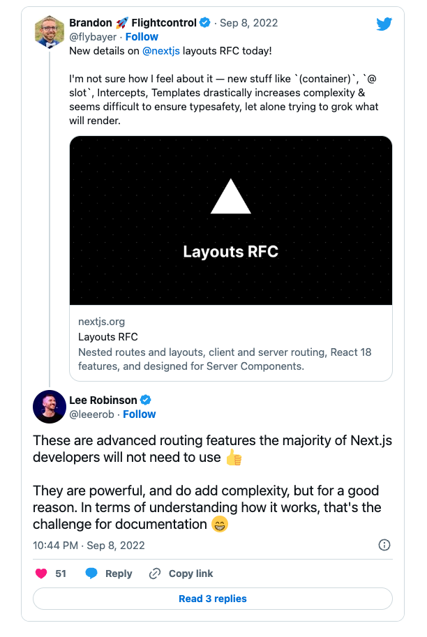

# You Don’t Need Next.js (and SSR)

Last week, Next.js 12.3 was released. This is not about the cool new things in it. It is more about weird opinions that comes to haunt every now and then when building Enterprise JavaScript applications with it.

There are two sides to the technology. First, technology doesn’t matter as long as you can build affordable solutions that truly solve users problems. For example, the choice between Python or Ruby, and/or between Java or Kotlin to build your Web application. We call this a flavor of the ecosystem that you or your team prefers.

However, the second side is more interesting — Choosing the right tool for the right job. This is where the confusion lies. No one is omniscient. Even when we attempt to do objective analysis, it is based on subjective experiences. That’s exactly where Next.js comes into picture. All the goodwill built around it blurs the reality.

> TLDR; If you are not building SEO facing websites, you really don’t need Next.js

No doubt, `Next.js` is an incredible framework (`Inversion of Control`) for building React-based applications. And, rightfully, it deserves its position as the best framework since it was also one of the first true frameworks for React when none existed. The alternative that existed before `create-react-app` is simply a scaffolding tool and then additionally a CLI. In 2022, we have many options like `Fusion.js`, `Electrode`, `Remix`, etc.

There are many great articles outlining the best things Next.js has to offer. But they all fail to answer this basic question — Is Next.js the right tool for your job? But before we answer this question, let’s address some of the shortcomings of Next.js.

## Before we begin (Update after publishing article):

I should be honest as I received some criticism on Reddit after posting a link to this article: [Criticism](https://www.reddit.com/r/javascript/comments/xh6qbp/you_dont_need_nextjs_and_ssr/)

## Next.js — Bad Parts

## About Aggressive Opinions

Due to the SSR capabilities, the design choices of Next are extremely opinionated. It is all evident in the kind of structures that Next imposes for the application. Few examples are:

- File-based routing: File-based routing reduces composability of the application. For example, I cannot have a few pages as a separate NPM package that can be developed by a different team. Composability is a must for a large-scale application. Yes, it is possible in some ways in Next, there is no clean way around it. It is a long-learned lesson in building web applications that routing should always be declarative in nature.

- Next Middleware: Next 12.2 severely cut down the middleware functionality to fit it with Vercel’s serverless/edge computing model. You can no longer return response body from the middleware. This is not a good characteristic for something that claims to be a framework. A framework is an abstraction which is supposed to hide complexity and not altogether kill a feature.

- Poor Man’s API: The only reason why Next API exists is to write BFF — Backend for Frontend because you want to handle server-side secrets. Good API servers allow us to maintain state on an application context or request context. Only way to maintain state in Next is stateful ESM modules and we know true singletons are difficult to maintain especially when we have bundlers sitting in between. And, then it is not easy to mock static ESM imports.

- The only reason why Next API exists is to write BFF — Backend for Frontend because you want to handle server-side secrets. Good API servers allow us to maintain state on an application context or request context. Only way to maintain state in Next is stateful ESM modules and we know true singletons are difficult to maintain especially when we have bundlers sitting in between. And, then it is not easy to mock static ESM imports. Context objects are necessary as they ease testing by supporting dependency injection patterns and providing well defined lazy or eager initialization of various application state objects.

In my personal opinion, I often feel like Next is designed to be a framework specifically meant to run on edge or serverless platforms.

## About Application Topology

Broadly speaking, from the frontend perspective, there are 4 categories of applications:

- Monolithic/standalone application
- Mini application
- Micro application
- Plugin-based application (Micro frontend)

These categories vary depending on the scale, lifecycle and the runtime context of the application; that’s all together a topic worthy of another article. Next is designed to build standalone/monolithic frontend applications. In many organizations, splitting a large application into multiple smaller applications is the simplest way to tame the scaling and complexity concerns. This is achieved using a simple Node.js server that can serve multiple frontend applications.

If we decide to go this route with Next.js, the end result would be that we end up creating applications running in complete silos. There is no easy migration path afterwards. Each app gets deployed on a subdomain or completely different domain. All the other concerns like access control, session management, tracking, etc. become complex.

To have all the apps running on the same domain via different paths, in Next, the only straight out-of-box is using Zones. Zone is not an API but a deployment concept supported only on Vercel. If you are not using Vercel, then you have to build your own system to enable reverse-proxy or Gateway equivalent to map the incoming URLs.

## About Application Packaging

Unless we sacrifice many of the out-of-box capabilities of Next and add some magical constructs, we would never be able to package it as a library, after all, it is a framework and build tool combined as one.

> For example, I had a requirement to build a common stack to build multiple Next-based applications running on different subdomains but with common logging, authentication, security, etc. As a good quality attribute these concerns should be hidden away from application developers but Next enforces those to be visible because of the way it functions.

It is still an open question on StackOverflow: [How to package Next.js application as a reusable Node library](https://stackoverflow.com/questions/71752233/how-to-package-next-js-application-as-a-reusable-node-library)

The only way we could achieve this was using a custom `Node.js` server using `Koa.js` which took care of these things and were able to ship it as a library.

Even if we can provide it as a library, the amount of boilerplate would be big and cumbersome. The other alternative is CLI or some template solution which would not be practical by needing to keep it updated across all the applications.

About Tight Coupling
Next apps have extremely tight coupling across the front-end activities starting from building applications to deployment. It also exists in how applications are run between server and client. It means we simply lock ourselves in it. It is nearly impossible to assemble/upgrade/experiment with the system in parts. If applications have even a slightly longer lifespan, then it is an unacceptable architectural choice.

To be more specific, every Next application has three control cycles:

- Server cycle
- Client cycle
- Build cycle

All these three cycles are tightly coupled. Since when an anti-pattern suddenly started becoming acceptable! It is true that it improves certain ergonomics of building web applications, but in the long run, explicitly decoupled entities are much better to reason about.

## About Software Composition

If possible, software should be composed, not built, only add code to glue existing pieces together. As we should be in control of this composition. Next takes that control away from us. Just like we don't buy a car whose parts cannot be replaced, a technology should not be adopted when you cannot replace it in parts.

> To highlight the composition aspect, we can think of Next.js as three things: Framework, CLI and Compiler.

Webpack is the compiler used by Next.js. The problem is that it is impossible to use Next without Webpack. A long living software needs good architecture which allows us to upgrade in parts or in full. Abstractions that can work independently is must.

About Onions and Layers
A clean application architecture should always follow some form of well defined pattern. It can be traditional layered architecture (Layer n of the application should only talk to n+1 layer and called by n-1 layer) or hexagonal/clean/onion architecture (inverted dependencies). And it is more applicable especially for writing API driven services.

> There could be an argument here that Next is only frontend framework and not an end-to-end full-stack framework. But, that’s not how it is being advertised. This is the feature list from the Next website:

This is further fueled on social platforms like Reddit, Twitter, Hacker News, etc. by arguments like below and then there are countless such [threads](https://www.reddit.com/r/nextjs/comments/esj0l8/is_it_recommended_to_use_nextjs_for_a_fullstack/?utm_content=body&utm_medium=post_embed&utm_name=6b1fa6fc8165423aa7fe33ec179a762d&utm_source=embedly&utm_term=esj0l8).

Certainly, Next doesn’t help to confine to this design principle.

## About Deployment Model

It is difficult to follow 12-factor methodology for buildings apps with Next applications. [12-factor application](https://stackoverflow.com/questions/70565191/how-to-enable-12-factor-application-bundling-with-next-js)

Next supports four types of rendering:

- Server-side Rendering (SSR)
- Static Site Generation (SSG)
- Client-side rendering (CSR)
- Incremental Static Generation (ISG)

**Never mind the fact that CSR is not the default or treated as a first class citizen**! In an attempt to become a jack of all trades, things are not so obvious in Next. [Handling environment](https://nextjs.org/docs/basic-features/environment-variables) is a classic example. From the Next documentation:

> In order to keep server-only secrets safe, Next.js replaces process.env.\* with the correct values at build time.

In reality, environment variables are build time environment variables whereas, runtime configuration is the one that most of the apps would need if they are using SSR or CSR. And, again the messaging is wrong:

Coming back to the original point, the question is not if something is supported or not. The question is — **how affordable is the architectural experience! So far, it is not!**

And ideal deployment model ensures proper software configuration management and embodies build once deploy anywhere ideals as defaults

## About Hydration (Should I say Rehydration)

> A Rehydration Problem: One App for the Price of Two

I am not a big fan of state hydration. It is simply fake. We are not yet there. It complex and difficult to reason about:

[The Prils of Rehydration](https://www.joshwcomeau.com/react/the-perils-of-rehydration/)

[Hydration is a pure overhead](https://www.builder.io/blog/hydration-is-pure-overhead)

As Miško Hevery says, it is a clunky workaround. I am not going to elaborate why hydration is bad or good! That’s a separate topic All I care is from architectural perspective which tells a different story:

> Application state hydration and then re-hydration is often specific in nature. An application should not rely on specific logic. There are very few applications that would need this. And, it is far less likely that you are the one to build those applications.

## About Ecosystem Cost & All the Things Code

Getting into SSR is not an easy thing. Any library that you expect to use with your code needs to be either compatible with SSR or you have to ensure that the code runs only on browsers. You cannot simply use a closure-based state for your libraries (Not suggesting that libraries should be having state). When you have multiple teams working in isolation, this problem quickly escalates.

At a code level certain things are impossible. For example, I cannot serve static files using some dynamic conditions. I can make use of API routes but that is more of a compromise than a solution.

[How to serve static file dynamically using Next.js?](https://stackoverflow.com/questions/71618052/how-to-serve-static-file-dynamically-using-next-js)

## Power and Perils of Next.js

To remind you that, this is not a complaint of Next in any way. It is simply about identifying the right use-cases. Out-of-box, Next makes so many things simple:

- Reasonably good Webpack compiler with amazing configuration
- Optimizations — static HTML pages, image optimization, polyfills, etc.
- Default router
- Pre-configured server — compression, caching, etc.
- Comprehensive rendering strategies

But most of the enterprise apps (explained below) exhibit a degree of customization. The moment we need to make these changes with Next or fall out of what it provides, we run into problems.

Rather than finding solutions to corner cases, it is better to write our own Website configuration, spin up a server and build a React app.

## Ideal Next.js Fit

> With all its inherent architectural issues, there are many use cases where Next.js is an obvious fit.

There are websites and then there are `web applications`. Websites are usually static and content heavy in nature. Next.js with SSG and ISR rendering is definitely an ideal fit. It is vastly simpler than Gatsby-based websites and provides a much better component model via React compared to other static site builders.

> Next.js excels at building SEO/Open Graph compatible websites and applications. Also, it is an excellent choice for websites like Amazon, Flipkart, etc. where time to content is absolutely critical.

When it comes to web applications, SEO facing apps like eCommerce apps, social apps like Twitter are definitely worth building in Next.js/SSR-based solution.

## Enterprise Software

Vast majority of the apps that we ordinary developers build are not Twitter or Amazon. We end up building enterprise software that is sold via B2B or B2C channels to micro-businesses. Such a SaaS software is sitting comfortably far away from SEO behind authentication. I call it Enterprise Software.

Our day to day task managers, project management tools, note taking apps, spreadsheets, accounting tools, HR tools are all such kinds of software.

**For all its first-paint performance issues with CSR — client-side rendering, it is still amazingly decoupled and simpler architectural model**. The state between server and client is disconnected. With the right mix of Service Workers, offline experience, CDN, simple authentication server and HTTP2, CSR can deliver amazing performance especially for that first byte matrix.

As an enterprise application framework, Next is not Django or Rails. All you have to do is to ask better questions:

Future and Next.js

Next team keeps advocating it as a full stack framework without really providing a good context, such as this:

So, it is hard to say where Next is heading but its increased usage beyond intended use-case may cause it to move in an even more opinionated direction by supporting required patterns in its own peculiar ways.

There is no doubt that it will complicate things with Next. New Layout RFC is certainly complex:

[Layouts RFC](https://nextjs.org/blog/layouts-rfc)

And, the responses by the core team are not exactly convincing, at least to me!

In my personal opinion, Next should work on composability story further instead of trying to be Django of the Node.js world. The great engineering value lies in making SSR rendering usable as a simple library rather than a full-fledged framework. In the words of legendary Joe Armstrong, Next feels like a Banana.

> You wanted a banana but what you got was a gorilla holding the banana and the entire jungle.
> — Joe Armstrong (Erlang)

The problems with monoliths comes to haunt in unexpected ways:

## Conclusion

50 years ago, a framework that could not define a good application boundary was supposed to be a poor design! It is still the same today. And Next.js simply amplifies that poor aspect. Maybe, creators of Next.js did not intend for users to use it outside of its scope. But it is out there and it is hard to control its applicability, mostly due to not being aware of the domain or exact business requirements.

Simplicity is not the enemy. It is the best friend you can have. **If your app is behind login and has no requirements for edge rendering, extremely sensitive web performance matrix, then probably Client-side Rendering (remember it is extremely cheap on pocket) or old-school server-rendered websites with progressive JavaScript are much better options.**

Although, we discussed about SSR in the context of Next.js, most of the arguments would still apply to other frameworks where such universal rendering is provided.

Again to remind you, Next is an amazing framework but there are limited use-cases where you should embrace it. Next is very well on its way to experience OOP boom as quoted by Eric Raymond:

[Unix and Object-Oriented Languages](http://www.catb.org/~esr/writings/taoup/html/unix_and_oo.html)

This article shades some light on Enterprise Software and Recommending **CSR** for non public facing SEO applications for its amazing simplicity. But getting CSR right is an art. We will discuss these topics in subsequent articles.

## Credits

Thanks to Charushila Patil for amazing illustrations and countless folks for sharing their experience with Next.js.
