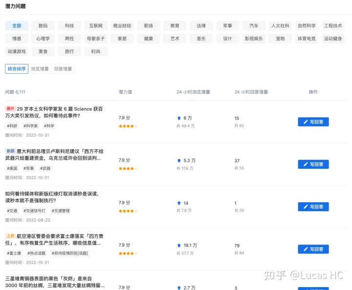
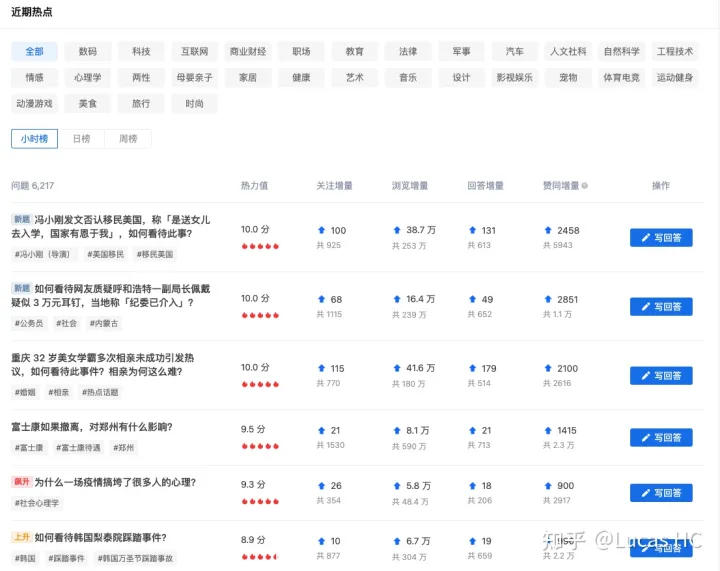
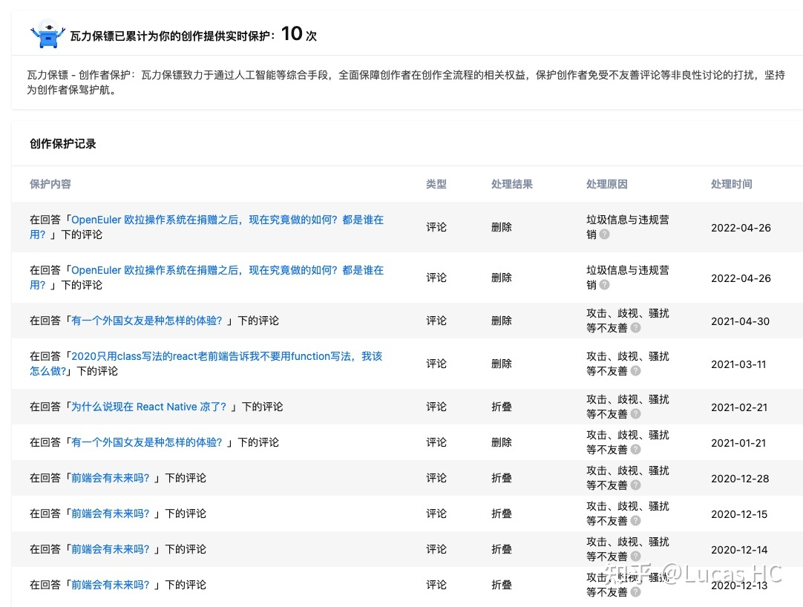
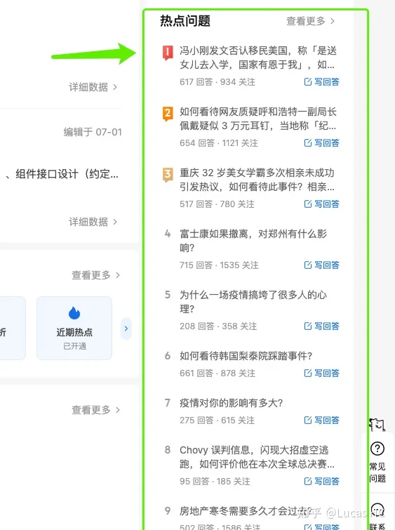

# 分离 ui 和业务逻辑

「ui」和「逻辑」这两个关键词切⼊分析，结合近⼏年前端流⾏的 headless ui，从更⼤的背景下，来重新
思考这个问题。

## UI 和逻辑

就拿知乎-创作中心举例，我们看几个页面截图：

创作中心-潜力问题



创作中心-近期热点



创作中心-瓦力保镖



你有没有觉得这些⻚⾯都「⻓得很像」？

我们当然可以将 table / list 抽象，⽤类似 scheme 驱动的⽅式终结各个⻚⾯烟囱式实现的状况，最⼤化提升
开发效率。但是，你再看看下⾯这个截图：创作中⼼-热点问题模块



哎呦，⻓得好像不⼀样了。前端开发同学应该深有体会，阻碍表单 / 列表类统⼀的⼀个原因是各场景样式、ui
都有差异。

在设计层⾯，可能由于业务需求，很难做到统⼀，不得已⾃带设计体系；另⼀⽅⾯，后端数据模型
没有统⼀，因此对接数据前后涉及到的前端状态管理、数据流转也未能统⼀，复⽤性⼤打折扣。

⽽躲在这些需求的背后，本质都是是同⼀套数据模型的渲染。
现实情况可能却是，ui 层⾯离领域模型很远，上图中举例到的知乎创作中⼼场景，产品经理可能某天突然想
展示某些数据，突然想加⼊ 「海盐计划」 4.0，「灯塔计划」，「致知计划」等明细，从 ui 上很容易把数据模
型拆解的七零⼋碎，后继开发者很难从⻚⾯看出其背后的领域和数据模型。前端从此和产品、业务渐⾏渐远。

由于我们对于领域知识理解严重匮乏，逐步沦为切图和填充数据字段的⼯具⼈，⽽真正能够进⾏统⼀抽象的数据模型，状态管理机制，副作⽤处理没有得倒应有的沉淀；后端同学⾯对着分散各⾃领域的存储表，也很难有端到端渲染层⾯的数据模型概念。

## Headless to resuce

我们先对 headless ui 下⼀个定义：

> Headless 组件即⽆ ui 组件，表示仅提供 UI 元素和交互的数据状态逻辑、状态、流转处理和 API，但不提供标记、样式或预构建实现（或另外实现）。

事实上，构建复杂 ui 最难的部分通常围绕状态，事件，副作⽤，数据的计算和管理。通过将标记，样式和实现细节先剔除，我们的逻辑和组件可以更模块化和重复使⽤。这样带来的好处是业务有极⼤的 ui ⾃定义空间，⽽对框架来说，只考虑逻辑可以让⾃⼰更轻松的覆盖更多场景，满⾜更多开发者不同的诉求。

Headless ui 是如何解决问题的呢？简单说，headless ui 组件开发者需要关注逻辑节点⽽⾮ UI 节，重点⼯作
包括设计并实现 combinators/primitives, data-processing, state-management, business logic。这样⼀来，
开发者从⽇常的「实现 markup, styles and implementation details」⼯作中解放出来，最终⽬标是提供更加
modular and reusable 的组件。

分⼯和职能上，根据团队可能会分化为基础能⼒前端研发 和 UI 侧前端研发来说，对应：

- 基础能⼒前端研发只需要聚焦⼴义的 functional features，这⾥⾯包括了数据流设计 等
- ui 侧前端研发具备完全的组件 appearance(any style) 控制权，更贴合业务需求

这样两种类型的前端开发者（业务 ui 敏感 & 模型抽象敏感），都有各⾃的主战场和技能发挥舞台。

## Headless ui 和 hooks

真正理解 React hooks 的同学，可能会联想到 React Hooks 是 Headless ui 在 React 世界中得以实现的基⽯。

从⾯试⼋股⽂中，我们就知道 hooks 的好处是可以⾃定义 hooks，将业务逻辑 封装在⾃定义的 hooks
⾥，然后将状态和控制器导出给 ui 使⽤，⼤⼤减少了 ui ⾥的模板代码，并且有效分离了 ui 定义和业务定义、
层次分明。

在 [不败花⼂：全新的 React 组件设计理念 Headless UI ⽂章中](https://zhuanlan.zhihu.com/p/578736019)，
作者认为「正是因为 React Hooks 的诞⽣，使 Headless ui 组件在技术上成为可能，这也是它为什么最近才开始流⾏的原因。」
我们不妨来看⼀个有趣的例⼦（[headless-user-interface-components](https://www.merrickchristensen.com/articles/headless-user-interface-components/):


业务侧需求：在抛硬币实现猜正反的场景中，实现一个相关硬币组件（先不描述的太具体，这里只做一个例子）。

实现原型

```js
// prototype version 1
const CoinFlipV0 = () =>
  Math.random() < 0.5 ? <div>Heads</div> : <div>Tails</div>;
```

开发阶段实现样式 mockup

```js
// ui implementation
const CoinFlipV1 = () =>
  Math.random() < 0.5 ? (
    <div>
      
    </div>
  ) : (
    <div>
      
    </div>
  );
```

业务需求变更 / 扩大 1：一个新场景需要在页面上使用 label 显示抛硬币结果。对应实现上，组件代码需要加入 `showLabels` 作为组件参数

```js
export const CoinFlipV2 = ({ showLabels = false }) =>
  Math.random() < 0.5 ? (
    <div>
      
      {showLabels && <span>Heads</span>}
    </div>
  ) : (
    <div>
      
      {showLabels && <span>Tail</span>}
    </div>
  );
```

业务需求变更 / 扩大 2：一个新场景需要设计有一个按钮，来实现执行「重新抛硬币」的能力。

```js
export const CoinFlipV3 = ({ showLabels = false, showButton = false }) => {
  const [state, setState] = React.useState(flip());
  const handleClick = () => setState(flip());
  return (
    <>
      {showButton && <button onClick={handleClick}>Reflip</button>}
      {state.flipResults < 0.5 ? (
        <div>
          
          {showLabels && <span>Heads</span>}
        </div>
      ) : (
        <div>
          
          {showLabels && <span>Tails</span>}
        </div>
      )}
    </>
  );
};
```

在 headless 的设计理念下，我们将组件的逻辑 logic 和样式 & UI 部分接耦（这⾥还不涉及到数据交互，更多的⼯程场景还会涉及到的相关 API 数据处理等）。

实现纯 logic 层组件，样式 & ui 部分通过渲染业务⾃定义的 children 的⽅式实现：

```js
export const CoinFlipLogic = ({ children }) => {
  const [state, setState] = React.useState(flip());
  const handleClick = () => setState(flip());
  return children({
    handleClick,
    isHeads: state.flipResults < 0.5,
  });
};
```

注意看，我们的实现中只关注硬币正反⾯ state 以及相关重置状态按钮的响应事件，并通过 `isHeads` 和 `rerun` 两个「能⼒」提供给业务使⽤。
那么相关业务使⽤场景（严格来说这还不是最终的业务实现层，⽽是介于业务和基础实现的中间层，即 `base` 上层的 `biz` 能⼒）对应的代码如下：

```js
export const CoinFlipV4 = ({ showLabels = false, showButton = false }) => (
  <CoinFlipLogic>
    {({ rerun, isHeads }) => (
      <>
        {showButton && <button onClick={rerun}>Reflip</button>}
        {isHeads ? (
          <div>
            
            {showLabels && <span>Heads</span>}
          </div>
        ) : (
          <div>
            
            {showLabels && <span>Tails</span>}
          </div>
        )}
      </>
    )}
  </CoinFlipLogic>
);
```

代码似乎变多了，但是逻辑更清晰了，分⼯更彻底了，对应业务能⼒更强了。 进⼀步优化，甚⾄我们可以将 isHeads 等逻辑拆的更⼲净，此时是⼀个 Probability 组件：

```js
const run = () => ({
  random: Math.random(),
});
export const Probability = ({ children, threshold }) => {
  const [state, setState] = React.useState(run());
  const handleChange = () => setState(run());
  return children({
    rerun: handleChange,
    result: state.random < threshold,
  });
};
```

使⽤⽅式：

```js
export const RollDiceV1 = () => (
  <Probability threshold={1 / 6}>
    {({ rerun, result }) => (
      <div>
        <span onMouseOver={rerun}>Roll the dice!</span>
        {result ? (
          <div>Big winner!</div>
        ) : (
          <div>You win some, you lose most.</div>
        )}
      </div>
    )}
  </Probability>
);
```

注意，这时候 interface 完全变更了（threshold, result），能够响应的事件也扩⼤了（这时候 `rerun` 的触发逻辑是⿏标划过事件）。

这个时候，（分离了 ui 和业务逻辑的）React hooks 该出场了，结合 React hooks，上⾯的这个例
⼦可以得到⾮常天然的落地实现。如下：

```js
export const useProbability = ({ threshold }) => {
  const [state, setState] = React.useState(run());
  const handleChange = () => setState(run());
  return {
    rerun: handleChange,
    result: state.random < threshold,
  };
};
export const RollDiceV2 = () => {
  const { rerun, result } = useProbability({ threshold: 1 / 6 });
  <div>
    <span onMouseOver={rerun}>Roll the dice!</span>
    {result ? <div>Big winner!</div> : <div>You win some, you lose most.</div>}
  </div>;
};
```

## Headless ui 和 React hooks 背后的架构思想变⾰

如果你理解了上⾯场景想要表达的 headless 概念，那么你可能对 React 全⾯推进 hooks feature
⾰命的背后逻辑也会更加清楚。

`React hooks`，`headless ui` 理念轰轰烈烈推进背后是 ui library 向 -> logic utility 的转型或分化,
都是我们更优雅地前端组件级 `biz`, `base` 合理分层的武器。

⽽反观像 antd 这种 ui/component library ⼤⽽全的武器，毫⽆疑问能帮助我们迅速开发，完成从零
到⼀的建设，也能⽀撑迅速迭代的需求。但总有⼀天，随着业务的发展，逻辑的膨胀，前端在组件
的架构上总会出现明显的需要升级的暗号，这些暗号就藏在我们上述开发场景的⻚⾯截图背后，藏
在重复代码的背后。

> 除此之外，更多需要考虑 headless ui 的⼀些表象：系统难以维护；系统变得更加脆弱，开发⼈ 员不知道在进⾏变更的时候会破坏其他功能，或者需要承担较多的⼼智负担来理解消化；要从⼀个技术栈转移到另⼀个技术栈时不得不对整个系统进⾏修改；当多个团队在同⼀个代码库中进⾏交付时，会造成代码库的混乱，我们难以保持应⽤处于最新状态，难以升级版本；在没有团队负责维护和改进的情况下，有些代码会被遗弃，团队之间没有明确的责任；

纵观社区上的⼤部分现存巨型组件库 ，往往都不先在内部抽象数据和逻辑模型 ，同⼀个组件库
中，不同 ui 组件实现却完全异构。我们错误地执迷于描述组件可以做什么，从⼤的块⾥取东⻄；⽽
不是描述⾃⼰⻓什么样，如何从⼩的组成⼤的。Modular and reusable composable 成为永远飘
着空中难以落地的⼝号。

我们发现，antd 中 #issues/5910：对于重型组件的基于功能粒度的拆分能⼒ 引起了⼴泛热议，甚
⾄ antd 组件 #5910 很难和⼀个时间处理的 moment utility 剥离。

记得 @徐飞 讲个⼀个有趣的观察：
前端⼯程师当看待⼀个服务接⼝的时候，如果它提供了⼏⼗个参数，并且不分类，不分层，你⼤概
率觉得那是⼀个很糟糕的东⻄，绝对不⾜以成为⼀个可复⽤体系的基础。但是当你看⻅⼀个⼏⼗个
props 也不分类不分组的前端组件 ，⼤部分却觉得组件化就是这样，它应该是很好的底层库。

## headless ui 和 hooks 落地和开源社区方案

headless ui 和 hooks 落地和开源社区 ⽅案既然已经扯远这么多，
那我们就继续聊⼀下 headless ui（或者在 React scope 下，hooks）的开源
和落地情况吧。往⼤了说，headless ui 涉及到前端团队职能的分化，涉及到前端组件⽅案的颠覆。
往⼩了说，落地上，我们可以找到⼀个垂直场景，借助开源社区已有能⼒的基础，实现 atomic
headless ui（开源提供） -> biz headless ui（我们封装） 的设计。

⽬前社区 headless ui 开源⽅案主要是更 low level 组件的封装，⼯程上，我们可以基于良好封装的
low level headless ui 开源库，实现业务关联（往往是数据获取和处理）的 biz headless ui。这个过
程，需要后端数据建模抽象，需要前端⽆缝对接。事实上，前后端⼀体的渲染层 <-适配层 <-模型
层 <-存储层都需要默默提升。⼀个 LCDP（Low-Code Development Platform）的完成度，依赖
每⼀层的进⼀步进展。更⻓远和更理想的这个话题我们姑且不表，先回到前端层⾯开源社区⽅案。

- headlessui.com: Completely unstyled, fully accessible UI components, designed to integrate
  beautifully with Tailwind CSS.
- React Table Library: Build and design powerful datagrid experiences while retaining 100%
  control over markup and styles.
  - 典型的 lightweight table libraries（虽然他的作者认为是界于 heavyweight 和 lightweight 之间，但其实更偏向 lightweight）
  - 兼容更现代化的 composition over configuration, customization, extensibility, and SSR 理
    念。
  - ⽅便进⾏扩展，⽅便我们和后端模型相结合
- tanstack.com/table: Headless, type-safe, powerful utilities for complex workflows like Data
  Management, Data Visualization, Charts, Tables, and UI Components
  - 更加符合 headless 理念的实现，相⽐ React Table Library 更加适合业务⼯程场景。React
    Table Library 更多是在 weight 上的考量，⽽对于 headless 理念以及背后的数据状态管理理念
    相对涉及较少，友好度不如 tanstack.com/table
  - ⽣态蓬勃，基于 tanstack.com/table 存在：
    - tanstack.com/query: Powerful asynchronous state management。这⼀部分当然更适合业
      务⼯程对接⾃⼰的数据模型来实现
    - tanstack.com/router
    - tanstack.com/virtual: Headless UI for Virtualizing Large Element Lists
    - react-charts.tanstack
    - ...
  - 可⽆缝对接后端 / 数据模型，同时较适合衍⽣出⼯程的 state, events, side-effects, data
    computation/management 前端模型
- downshift-js.com：Primitives to build simple, flexible, WAI-ARI compliant React
  autocomplete/combobox or select dropdown components.
- radix-ui.com：Unstyled, accessible components for building high-quality design systems
  and web apps in React.
- react-spectrum.adobe.com/react-aria：A library of React Hooks that provides accessible UI
  primitives for your design system.
- 抖⾳前端 semi.design：
  - 国内⼤⼚的⼀个实现，Semi 从未尝试约束⽤户，固化所谓的「统⼀规范」，⽽是在默认基础
    上，充分进⾏模块化解耦，并开放⾃定义能⼒，⽅便⽤户进⾏⼆次裁剪与定制，搭建适⽤于不
    同形态产品的前端资产

## 总结

`React hooks` 当然有必要分离 `ui` 和 `logic`，这是刻在 `React hooks` 基因⾥的要义，也是 headless ui
理念的落地基⽯。我们从⼀个问题中，以⼩⻅⼤，聊了前端分⼯，前端边界，前端趋势和发展，但
这不是⼀篇「阿⾥味」的恢弘叙事⻓⽂，在开喷前，不妨静下⼼来读⼀下，尝试感受回答中的诚
意。

最后，headless ui 不是孤⽴存在的：向前（卷设计、卷业务），我们可以通过 `tailwindcss.com/` 这
样的平台协助解决样式管理⽅案、定制样式或设计体系，做到系统对接，体系建设（常⻅于中⼩公司）；
向后（卷后端），我们可以通过统⼀数据建模，对接渲染抽象能⼒，更⾼效地实现前后端⼀
体的 LCDP（Low-Code Development Platform） ⻚⾯搭建等需求。卷前端卷我们⾃⼰，在
headless ui 基础上，把数据层⾯（数据驱动）、adapter 适配做到极致，找到前端 ui 和逻辑资产沉
淀的空间，我们的想象⼒、我们的⽬光本可以更⻓远。
