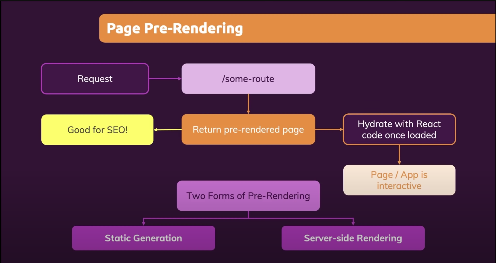

This is a [Next.js](https://nextjs.org/) project bootstrapped with [`create-next-app`](https://github.com/vercel/next.js/tree/canary/packages/create-next-app).

## Getting Started

First, run the development server:

```bash
npm run dev
# or
yarn dev
```

Open [http://localhost:3000](http://localhost:3000) with your browser to see the result.

You can start editing the page by modifying `pages/index.js`. The page auto-updates as you edit the file.

[API routes](https://nextjs.org/docs/api-routes/introduction) can be accessed on [http://localhost:3000/api/hello](http://localhost:3000/api/hello). This endpoint can be edited in `pages/api/hello.js`.

The `pages/api` directory is mapped to `/api/*`. Files in this directory are treated as [API routes](https://nextjs.org/docs/api-routes/introduction) instead of React pages.

## Learn More

To learn more about Next.js, take a look at the following resources:

- [Next.js Documentation](https://nextjs.org/docs) - learn about Next.js features and API.
- [Learn Next.js](https://nextjs.org/learn) - an interactive Next.js tutorial.

You can check out [the Next.js GitHub repository](https://github.com/vercel/next.js/) - your feedback and contributions are welcome!

## Deploy on Vercel

The easiest way to deploy your Next.js app is to use the [Vercel Platform](https://vercel.com/new?utm_medium=default-template&filter=next.js&utm_source=create-next-app&utm_campaign=create-next-app-readme) from the creators of Next.js.

Check out our [Next.js deployment documentation](https://nextjs.org/docs/deployment) for more details.

## What is NextJS and Why

- The React Framework for Production
  - You still write React code, you still build React components and use React features (props, state, context, ...)
  - NextJS just enhances your React apps and adds more features
  - Lots of built-in featuers (e.g. routing) that help you solve common problems & clear guidance on how to use those features.
  - There are certain problems which you will need to solve for almost all production-ready React apps: NextJS solves those for you.
- A fullstack framework for ReactJS
- NextJS solves common problems and makes building React apps easier!

## NextJS key features

- Server-side rendering

  - Automatic page pre-rendering: Greate for SEO and initial load
  - Blending client-side and server-side: Fetch data on the server and render finished pages

- File based Routing

  - Define pages and routes instead of code
  - Less code, less work, highly understandable

- Fullstack capabilities

  - Easily add backend (server-side) code to your Next / React apps
  - Storing data, getting data, authentication etc. Can be added to your React project.
  - Don't have to build a standalone api project, but can be incorporated into the NextJS project.

- Two forms of Pre-rendering

  - Static Generation
  - Server-side Rendering
  - 

- Shared Contents
  - fallback: false / true / 'blocking'
  - vercel deployment & automation pipeline
  - optimizting images.
  -
